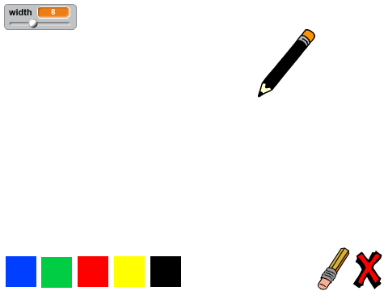
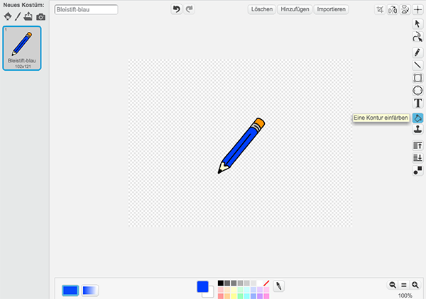
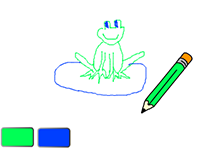
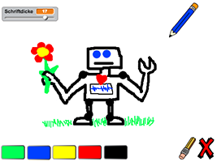

## Einführung

In diesem Projekt wirst Du Dein eigenes Zeichen-Programm bauen!




<div class="page-break"></div>


## Schritt 1: Einen Bleistift entwerfen

Lass uns damit starten, dass wir einen Bleistift entwerfen, mit dem man auf der Bühne zeichnen kann.

<div class="checklist-symbol">Checkliste</div>

- Starte ein neues Scratch-Projekt und lösche die Katzenfigur, so dass Dein Projekt leer ist.
- Füge Deinem Projekt diese Bleistift-Figur hinzu:


- Klicke auf ‘Kostüm’ und lösche das ‘Bleistift-b’-Kostüm.


- Benenne Dein Kostüm in ‘Bleistift-blau’ um und benutze das ‘Eine Kontur einfärben’-Werkzeug, um das Kostüm blau einzufärben.



- Da Du die Maus zum Zeichnen benutzen wirst, möchtest Du, dass der Stift immer bzw. <span class="control-block">wiederhole fortlaufend</span> der Maus folgt. Füge Deiner Bleistift-Figur diesen Code hinzu:

```blocks
    wenn die grüne Flagge angeklickt
    wiederhole fortlaufend
    gehe zu [Mauszeiger v]
```

<div class="test-symbol">Teste dein Projekt</div>
- Klicke auf die grüne Fahne und bewege die Maus auf der Bühne hin und her. Funktioniert es so, wie Du es Dir vorgestellt hast?
- Hast Du bemerkt, dass es die Mitte des Bleistifts und nicht die Spitze ist, die der Mausbewegung folgt?


- Um dies zu ändern, klicke auf das ‘Bleistift-blau’-Kostüm Deiner Bleistift-Figur und dann auf das ‘Drehpunkt des Kostüms’-Symbol.


- Du solltest feststellen, dass ein Kreuz erscheint. Du kannst nun knapp unter die Spitze des Bleistiftes klicken, um diese Stelle als das Zentrum der Figur zu definieren (Achtung: Nicht direkt auf die Bleistiftspitze klicken, da der Bleistift so nicht korrekt zeichnen wird).


- Klicke auf den Skripte-Reiter und teste erneut Deinen Bleistift. Funktioniert es nun besser als zuvor?
- Als nächstes, lass uns Deinen Bleistift zeichnen lassen, wenn die Maus geklickt wird. Füge diesen Code Deiner Bleistift-Figur hinzu:


<div class="test-symbol">Teste dein Projekt</div>
- Bewege dieses Mal den Bleistift auf der Bühne, während Du die Maustaste gedrückt hältst. Kannst Du mit Deinem Bleistift malen?


<div class="page-break"></div>


## Schritt 2: Farbige Stifte

Lass uns Deinem Projekt unterschiedlich farbige Bleistifte hinzufügen und es dem Nutzer so erlauben zwischen Ihnen zu wechseln.

<div class="checklist-symbol">Checkliste</div>

- Klicke auf Deine Bleistift-Figur, klicke dann auf ‘Kostüme’ und dupliziere das ‘Bleistift-blau’-Kostüm.


- Benenne Dein Kostüm in ‘Bleistift-grün’ um und füge ihm grün als Farbe hinzu.


- Erstelle zwei neue Figuren, welche Du benutzen wirst, um eine Farbe auszuwählen.


- Wenn das Grün-Auswahl-Symbol angeklickt ist, musst Du der Bleistift-Figur die Nachricht senden <span class="event-block">sende an alle</span>, die ihm mitteilt die Bleistiftfarbe in grün umzuwandeln.
- Um dies zu tun, füge dem Grün-Auswahl-Symbol diesen Code hinzu:

```blocks
    Wenn ich angeklickt werde
    sende [grün v] an alle
```

- Um einen <span class="event-block">sende an alle</span>-Block zu erstellen, klicke auf den nach unten zeigenden Pfeil und wähle 'Neue Nachricht...' aus.


- Du kannst nun 'grün' eintippen, um Deine neue Nachricht zu erstellen.
- Du musst Deiner Bleistift-Figur nun mitteilen was zu tu ist, wenn sie diese Nachricht erhält. Füge Deiner Figur diesen Code hinzu:

```blocks
    Wenn ich [grün v] empfange
    wechsle zu Kostüm [Bleistift-grün v]
    setze Stiftfarbe auf [#00ff00]
```

- Um die Stiftfarbe auf grün zu setzen, klicke die grün gefärbte Box in dem <span class="data-block">setze Schriftfarbe auf</span>-Block an und klicke anschließend auf das Grün-Auswahl-Symbol.
- Du kannst nun das Gleiche mit dem blauen Bleistift-Symbol tun, indem Du diesen Code zu der Blau-Auswahl-Figur hinzufügst:

```blocks
     Wenn ich angeklickt werde 
     sende [blau v] an alle
```

- …und indem Du diesen Code zu der Bleistift-Figur hinzufügst:

```blocks
     Wenn ich [blau v] empfange 
     wechsle zu Kostüm [Bleistift-blau v] 
     setze Stiftfarbe auf [#0000ff]
```

- Zuletzt musst Du Deiner Bleistift-Figur sowohl mitteilen, welches Kostüm und welche Stiftfarbe sie wählen soll, als auch den Bildschirm zu leeren, sobald ein neues Projekt begonnen wird. Füge diesen Code an den Anfang des <span class="event-block">Wenn die grüne Flagge angeklickt</span>-Code des Bleistifts hinzu (vor die <span class="control-block">wiederhole fortlaufend</span>-Schleife):


```blocks
     wische Malspuren weg
     wechsle zu Kostüm [blau-Bleistift v]
     setze Stiftfarbe auf [#0000ff]
```

<div class="test-symbol">Teste dein Projekt</div>

- Kannst Du zwischen dem grünen und dem blauen Stift hin und her wechseln?




<div class="page-break"></div>

## Schritt 3: Fehler machen

Manchmal passieren Fehler. Lass uns also unserem Projekt einen ‘wische Malspuren weg’-Knopf hinzufügen!

<div class="checklist-symbol">Checkliste</div>

- Lass uns einen Knopf hinzufügen und die Bühne leeren. Um dies zu tun, füge die ‘X-block’´-Buchstaben-Figur zu der Bühne hinzu und färbe sie rot.


- Füge Deinem ‘wische Malspuren weg’-Knopf diesen Code hinzu, damit die Bühne geleert wird, sobald dieser angeklickt wird:

```blocks
     Wenn ich angeklickt werde 
     wische Malspuren weg
```

- Bemerke, dass Du keine Nachricht versenden musst, um die Bühne zu leeren, da jede Figur diese Fähigkeit besitzt.
- Füge ein neues Kostüm zum Stift hinzu. Nenne es Radiergummi


- Du solltest das Radiergummi-Bild auch als eine neue Auswahl-Figur hinzufügen. So sollte Deine Bühne nun aussehen:


- Du kannst die Radiergummi-Auswahl-Figur von ‘eraser’ zu ‘Radiergummi’ umbenennen, den Drehpunkt des Radiergummis kurz vor die Radiergummi-Spitze setzen (wie beim Bleistift) und dem Radiergummi diesen Code hinzufügen, um dem Stift mitzuteilen, zum Radiergummi zu wechseln:

````blocks
     Wenn ich angeklickt werde
     sende [Radiergummi v] an alle
````

- Damit, sobald der Stift die Nachricht erhält, er zum Radiergummi wechselt und die Stiftfarbe ändert, füge ihm diesen Code hinzu:

```blocks
     Wenn ich [Radiergummi v] empfange 
     wechsle zu Kostüm [Radiergummi v] 
     setze Stiftfarbe auf [#FFFFFF]
```

- Teste Dein Projekt, um zu sehen, ob Du die Bühne leeren und radieren kannst.


- Es gibt noch ein kleines Problem mit dem Sift: Du kannst überall auf der Bühne malen, auch neben den Auswahl-Symbolen.


- Um dieses Problem zu lösen, musst Du dem Stift sagen nur dann zu malen, wenn die Maus angeklickt wird und wenn die y-Position der Maus größer als -110 (Maus y-Position> -120) ist. Ändere die wenn-Aussage Deines Stifts zu:


<div class="test-symbol">Teste dein Projekt</div>

- Es sollte nun nicht mehr möglich sein in unmittelbarer Nähe der Auswahl-Blöcke zu malen.


<div class="page-break"></div>


## Schritt 4: Die Stift-Dicke ändern

Lass es uns dem Nutzer erlauben eine Vielzahl an unterschiedlichen Stiftdicken zu nutzen.

<div class="checklist-symbol">Checkliste</div>

- Füge als Erstes eine neue Variable ‘Stiftdicke’ hinzu. Wenn Du Dir unsicher bist, wie das geht, wird Dir das Ballons-Projekt auf die Sprünge helfen.
- Füge diese Code-Linie innerhalb die <span class="control-block">wiederhole fortlaufend</span>-Schleife Deines Stift-Codes hinzu:

```blocks
    setze Stiftdicke auf (Stiftdicke)
```

Die Dicke des Stiftes wird nun auf den Wert Deiner ‘Stiftdicke’-Variable gesetzt.
- Du kannst die vorgegebene Nummer der Variable mit einem Rechtsklick auf die Variable (auf der Bühne) und mit einem Klick auf ‘Schieberegler’ ändern.


Du kannst nun den Schieberegler unter die Variable ziehen, um deren Wert zu ändern.


<div class="test-symbol">Teste dein Projekt</div>
- Schau ob Du die Stiftdicke verändern kannst.


Wenn Du möchtest, kannst Du die Minimum- und Maximumdicke, die erlaubt ist, festlegen. Um dies zu tun, führe wieder einen Rechtsklick auf die Variable aus und wähle ‘Regelbereich festlegen’. Setze den Minimum- und Maximumwert der Variable zu etwas sinnvollem wie 1 und 20.


<div class="page-break"></div>


## Herausforderung: Tastenkürzel

Kannst Du Tastenkürzel für Deine Befehle erstellen? Zum Beispiel:

<div class="checklist-symbol">Checkliste</div>

- b = Zum blauen Stift wechseln
- g = Zum grünen Stift wechseln
- r = Zum Radiergummi wechseln
- l = Bühne leeren

Du kannst es dem User sogar erlauben, die Stiftdicke mit den Pfeil-Tasten zu verändern!


## Herausforderung: Mehr Stifte

Kannst Du rote, gelbe und schwarze Stifte zu dem Zeichen-Programm hinzufügen? Die Bilder, die Du hierfür brauchst, findest Du in dem Ressourcen-Ordner. Vergesse nicht Tastenkürzel für die Stifte hinzuzufügen!

Kannst Du mit den Stiften ein Bild malen?


