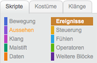

## Nachrichten senden

Um eine Nachricht von einer Figur zu einer oder mehreren anderen zu senden, brauchen wir den Block

```blocks
    sende [Nachricht1 v] an alle
```

Diese finden wir in der braunen Kategorie Ereignisse



<div class="checklist-symbol">Checkliste</div>

- Gehe zu <span class="event-block">Ereignisse</span> und ziehe den Block in dein Arbeitsberich
- Erstelle eine neue Nachricht "gewonnen" indem du auf den kleinen schwarzen Pfeil klickst und dann auf neue Nachricht...


## Auf Nachrichten reagieren

Eine Nachricht zu senden reicht alleine nicht, eine andere Figur muss auch auf die Nachricht reagieren.
Mit dem Block

```blocks
    Wenn ich [Nachricht1 v] empfange
```

können wir unserer Figur jetzt sagen was sie machen soll.

<div class="checklist-symbol">Checkliste</div>

- Wähle deine erstellte Nachricht "gewonnen" aus
- Lass deine Figur etwas sagen wenn die Nachricht ankommt

<div class="test-symbol">Teste dein Projekt</div>

## Tipps

Außerdem gibt es noch den Block

```blocks
    sende [Nachricht1 v] an alle und warte
```

mit dem die Figur, die die Nachricht abgesendet hat, wartet bis alle anderen Figuren fertig sind und dann erst weiter macht.

<div class="checklist-symbol">Checkliste</div>

- Benutze den Block in deiner Figur
- Reagiere auf die Nachricht in den anderen Figuren
- Lass deine Figur "Fertig" sagen, sobald alle anderen fertig sind

<div class="test-symbol">Teste dein Projekt</div>
