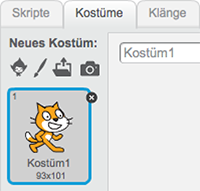

<br>

## Verstecken und zeigen

In vielen Szene wollen wir unterschiedliche Figuren haben. Wir dürfen die Figuren aber nicht löschen, da sie sonst ganz weg sind.

Hierfür gibt es den Block

```blocks
    verstecke dich
```

Jetzt ist deine Figur unsichtbar.
Wenn du sie wieder sehen willst, brauchst du den Block

```blocks
    zeige dich
```

<div class="checklist-symbol">Checkliste</div>

- Verstecke deine Figur
- Zeige deine Figur wieder

<div class="test-symbol">Teste dein Projekt</div>

<div class="page-break"></div>

## Kostüm wechseln

<div class="checklist-symbol">Checkliste</div>

- Schaue ob deine Figur mehr als 1 Kostüm hat indem du auf *Kostüme* klickst.



Wenn deine Figur mehr als 1 Kostüm hat, kannst du so zu Kostüm2 wechseln. 

```blocks
    wechsle zu Kostüm [Kostüm2 v]
```

Außerdem kannst du mehrere Kostüme nacheinander anzeigen indem du diesen Block benutzt.
 
```blocks
    nächstes Kostüm
```

<div class="checklist-symbol">Checkliste</div>

- Wechsle das Kostüm deiner Figur mit einem der Blöcke
- Ändere die Farbe deines Kostüms mithilfe des Blocks

```blocks
    ändere [Farbe v]-Effekt um (25)     
```

<div class="test-symbol">Teste dein Projekt</div>

<div class="page-break"></div>

## Hintergrund ändern

Wie bei den Figuren braucht auch die Szene mehrere Hintergründe um wechseln zu können.

<div class="checklist-symbol">Checkliste</div>

- Schaue ob deine Szene mehr als 1 Hintergrund hat indem du auf deine *Bühne* klickst.

Auch bei der Bühne gibt es wieder 2 Blöcke

```blocks
    wechsle zu Bühnenbild [Bühnenbild2 v]
```
```blocks
    nächstes Bühnenbild
```

- Lege ein neues Bühnenbild an
- Wechsle zum neu angelegten Bühnenbild

<div class="test-symbol">Teste dein Projekt</div>

<div class="page-break"></div>

## Szenenwechsel

Jetzt fügen wir alle Teile zusammen und bauen einen Szenenwechsel

<div class="checklist-symbol">Checkliste</div>

- Füge eine zweite Figur in deine Bühne ein
- Lege ein zweites Bühnenbild an

In unserer ersten Figur brauchen wir folgende Blöcke

```blocks
    wenn die grüne Flagge angeklickt
    gleite in (2) Sek. zu x: (255) y: (0)
    verstecke dich
    sende [Szenenwechsel v] an alle
```

Beim klicken auf die grüne Flagge startet die erste Szene, die Figur geht aus dem Bild und versteckt sich dann.

In unserer Bühne reagieren wir jetzt auf unsere Nachricht *Szenenwechsel*

```blocks
    wenn ich [Szenenwechsel v] empfange
    nächstes Bühnenbild
```

Jetzt sehen wir unser zweites Bühnenbild. In einer zweiten Figur legen wir jetzt folgende Blöcke an.

```blocks
     wenn ich [Szenenwechsel v] empfange
     zeige dich
```

<div class="test-symbol">Teste dein Projekt</div>
