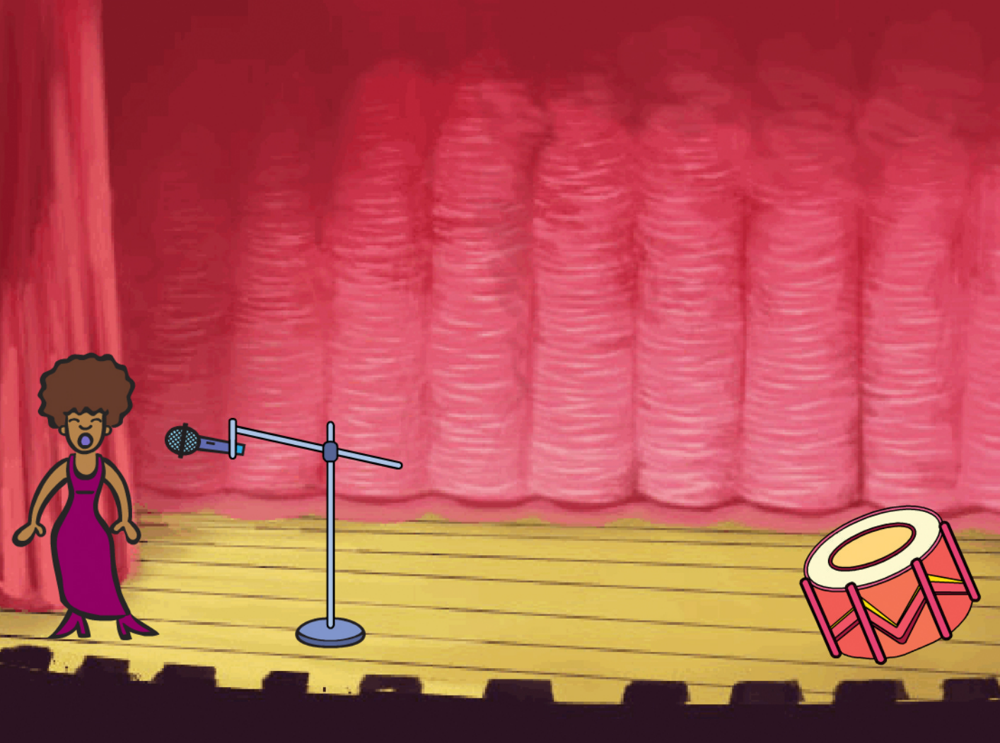

## Bilder 

Checkliste

- Aufgabe eins mit kurzer Beschreibung
  
- Aufgabe zwei mit einer längeren Beschreibung. Die Beschreibung geht über zwei Zeilen um das Styling der Seite zu testen

- Noch eine Aufgabe

## Programmieren

