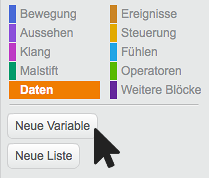
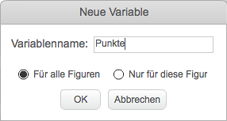
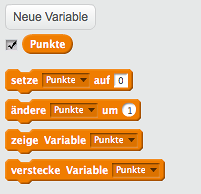
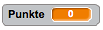
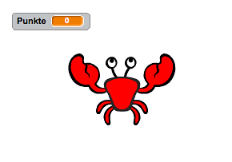

<div class="page-break"></div>

## Variable erstellen

<div class="checklist-symbol">Checkliste</div>

- Gehe zu *Daten* und klicke auf *neue Variable*  



- Gib jetzt einen Namen für deine Variable ein und klick auf *OK*  



Du siehst jetzt einen neuen Block mit dem Name der Variable.
  


Auf der Bühne wird die Variable auch angezeigt



<div class="page-break"></div>

## Punkte sammeln

Mit diesem Block kannst du die Punkte am Anfang auf 0 setzen

```blocks
    setze [Punkte v] auf [0]
```

Mit diesem Block kannst du dem Spieler mehr Punkte geben

```blocks
    ändere [Punkte v] um [1]
```

Wenn du eine Minuszahl reinschreibst verliert der Spieler Punkte

```blocks
    ändere [Punkte v] um [-1]
```

<br>

Du kannst das jetzt mit einem kleinen Spiel ausprobieren. Der Spieler bekommt Punkte, wenn er auf den Krebs klickt.




<div class="page-break"></div>

<div class="checklist-symbol">Checkliste</div>

- Erstelle eine neue Figur. Es muss kein Krebs sein.

- Erstelle eine Variable <span class="data-value">Punkte</span>

- Füge diese Blöcke bei der Figur ein. Die Punkte werden dann beim Start auf 0 gesetzt

````blocks
        Wenn die grüne Flagge angeklickt
        setze [Punkte v] auf [0]
````

- Füge diese Blöcke bei der Figur ein. Der Spieler bekommt dann immer einen Punkt wenn er auf die Figur klickt.

````blocks
        Wenn ich angeklickt werde
        ändere [Punkte v] um [1]
````

<div class="test-symbol">Teste dein Projekt</div>
